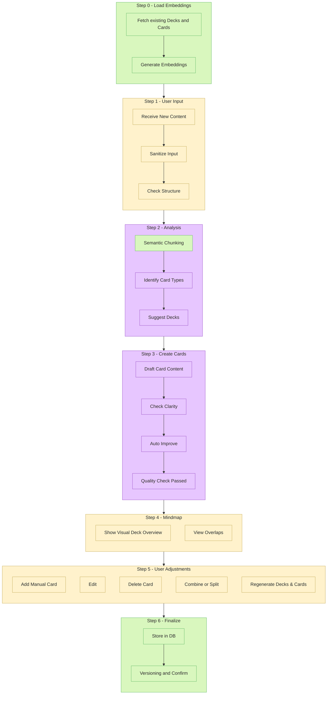
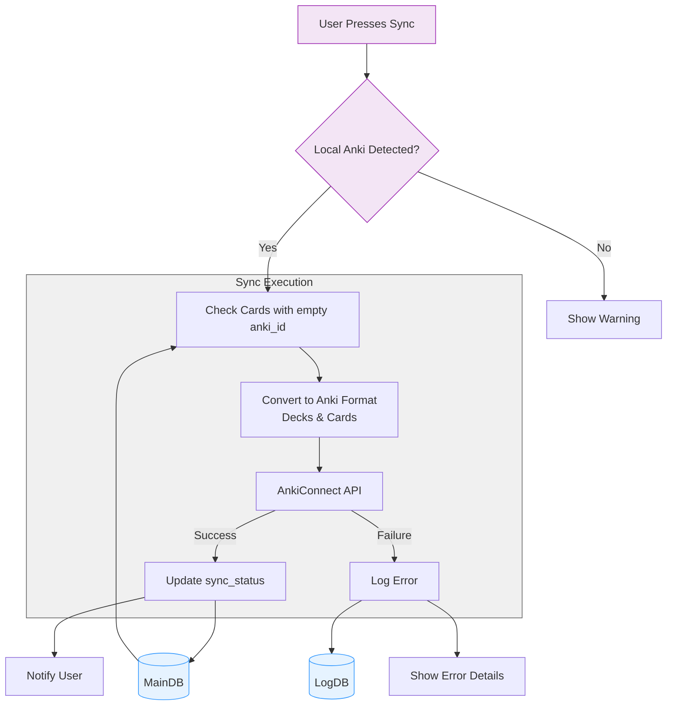

# Database Schema

```mermaid
graph TD
    %% ========== Database Schema ==========
    subgraph Databases
        %% ========== Main Database ==========
        subgraph MainDB["Main Database"]
            CardSchema
            style MainDB fill:#e6f3ff,stroke:#3399ff
        end

        %% ========== Log Database ==========
        subgraph LogDB["Log Database"]
            LogSchema
            style LogDB fill:#fff5e6,stroke:#ff9900
        end

        class MainDB,LogDB database
    end

    %% ========== Card Schema ==========
    subgraph CardSchema[card]
        direction LR
        subgraph Identifiers["Core Identifiers"]
            ID["id (UUID) [PK]"]
            USER_ID["user_id (STRING) [FK -> user.id]"]
        end
        
        subgraph Content["Card Content"]
            Question["question (TEXT)"]
            Answer["answer (HTML)"]
            %% question + answer hash
            CONTENT_HASH["content_hash (STRING) [UNIQUE]"]
        end

        subgraph CardData["Card Data"]
            DECK["deck (STRING) [INDEX]"]
            TAGS["tags ARRAY(STRING)"]
            PARENT_CARD["parent_card (STRING) (FK -> card.id)"]
        end
        
        subgraph Sync["Anki Sync"]
            ANKI_ID["anki_id (BIGINT) [UNIQUE]"]
            LAST_SYNCED["last_synced (TIMESTAMP)"]
            SYNC_STATUS["sync_status (ENUM: 'pending', 'synced', 'conflict')"]
        end
        
        subgraph ModelData["Model Data"]
            QUALITY_SCORE["quality_score (FLOAT)"]
            MODEL["model (STRING)"]
            MODEL_VERSION["model_version (FLOAT)"]
        end
        
        style Identifiers fill:#f0f8ff
        style Content fill:#f5f5dc
        style Sync fill:#ffe6e6
        style ModelData fill:#f8f8f8
    end

    %% ========== Log Schema ==========
    subgraph LogSchema[log_entry]
        direction LR
        subgraph CardLifecycle["Card Lifecycle"]
            LOG_ID["log_id (UUID) [PK]"]
            INTERNAL_UUID["internal_uuid (UUID) [INDEX]"] 
            %% Pre-generation UUID
            PARENT_LOG["parent_log_id (UUID?)"]
            OPERATION_TYPE["operation_type (ENUM: 'create_overview','create_card','fix_format', 'update', 'delete', 'sync')"]
        end
        
        subgraph Processing["Processing Info"]
            MODEL_VERSION["model_version (STRING)"]
            %% For deduplication
            INPUT_HASH["input_hash (STRING) [INDEX]"]
            PROCESSING_TIME["processing_time (INT)"]
            RETRY_COUNT["retry_count (INT)"]
        end
        
        subgraph TrainingData["Training Data"]
            USER_FEEDBACK["user_feedback (JSON)"]
            TRAINING_STATUS["training_status (ENUM: 'unused', 'in_training', 'processed')"]
        end
        
        subgraph System["System Metrics"]
            TIMESTAMP["timestamp (TIMESTAMP) [INDEX]"]
            ERROR_CODE["error_code (STRING)"]
            ERROR_DETAILS["error_details (JSON)"]
            %% CPU/RAM/GPU metrics
            RESOURCE_USAGE["resource_usage (JSON)"]  
            %% Operating System / OLLAMA Version
            SYSTEM_INFO["system_info (JSON)"]
        end
        
        style CardLifecycle fill:#f0f8ff
        style Processing fill:#f5f5dc
        style TrainingData fill:#e6ffe6
        style System fill:#ffe6e6
    end

    %% ========== Styling Definitions ==========
    classDef process fill:#f0f0f0,stroke:#666
    classDef decision fill:#ccebff,stroke:#006699
    classDef database fill:#e6f3ff,stroke:#3399ff
    class MainDB,CardSchema, database
```

# Main Flow
## Overivew
> Legend of Responsibilities
> UI/User (yellow boxes): Any step where the user directly interacts with the system, e.g., uploading or editing content, dragging cards between decks.
> System (green boxes): Steps handled by your backend or application logic (loading embeddings, providing mindmap views, saving to DB, etc.).
> LLM (purple boxes): Stages where natural language generation or advanced analysis (by a large language model) is the primary driver, such as card proposal, refinement, or quality checks.
> (“System+LLM” steps have been assigned the LLM color code for clarity, but you can split them further if you want a separate color for the purely “system” portion.)

## Details

### Anki Sync Flow
